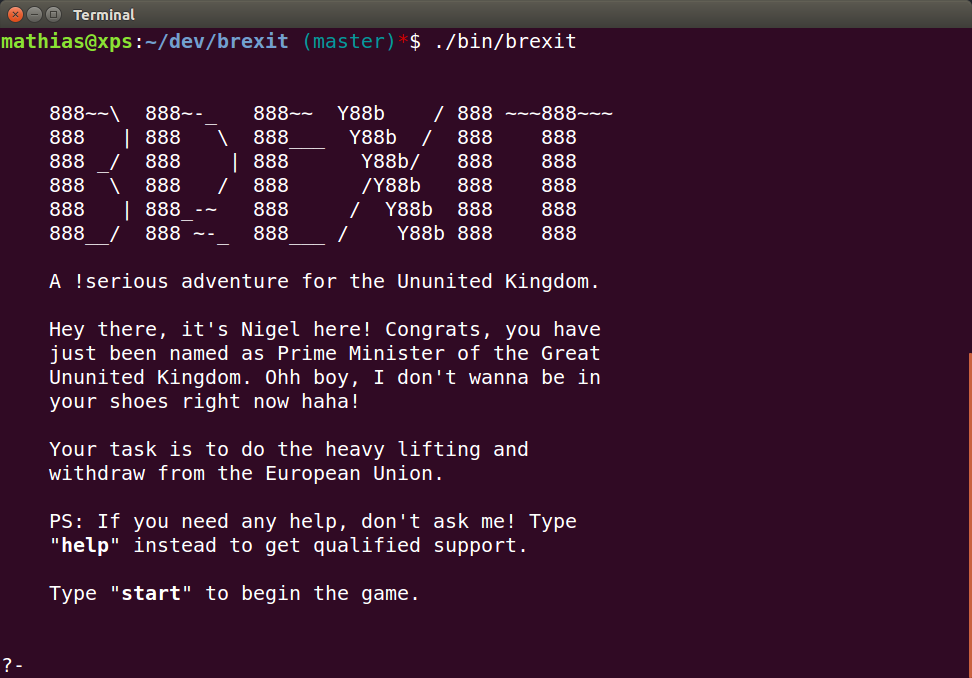

# BREXIT - A !serious adventure for the Ununited Kingdom
Just another text adventure written in [prolog](http://www.swi-prolog.org/).

## Part I - Road to Brexit
In the first part of this neverending story you will lead the UK from the Post-Cameron-Era to the beginning of the Brexit negotiations. The goal is to trigger the article 50 in Brussels.

C.f. [Transcript](transcript.md) for further support.

## Usage
```sh
# Use the shell start-up script,
$ ./bin/brexit

# or load the sources directly from within your prolog session
:- ['src/brexit'].
```

### Available commands
* `start.`: start a new game
* `n. s. e. w.`: go in that direction
* `look.`: look around
* `help.`: show help message
* `version.`: show game version information
* `quit.`: end the game and quit

## License
This distribution is covered by the **MIT LICENSE**, for the full copyright and license information, please view the LICENSE file that was distributed with this source code.

## Support & Contact
Having trouble with this repository? Check out the documentation at the repository's site or contact m@matchilling.com and we’ll help you sort it out.

Happy Brexit

:v:
